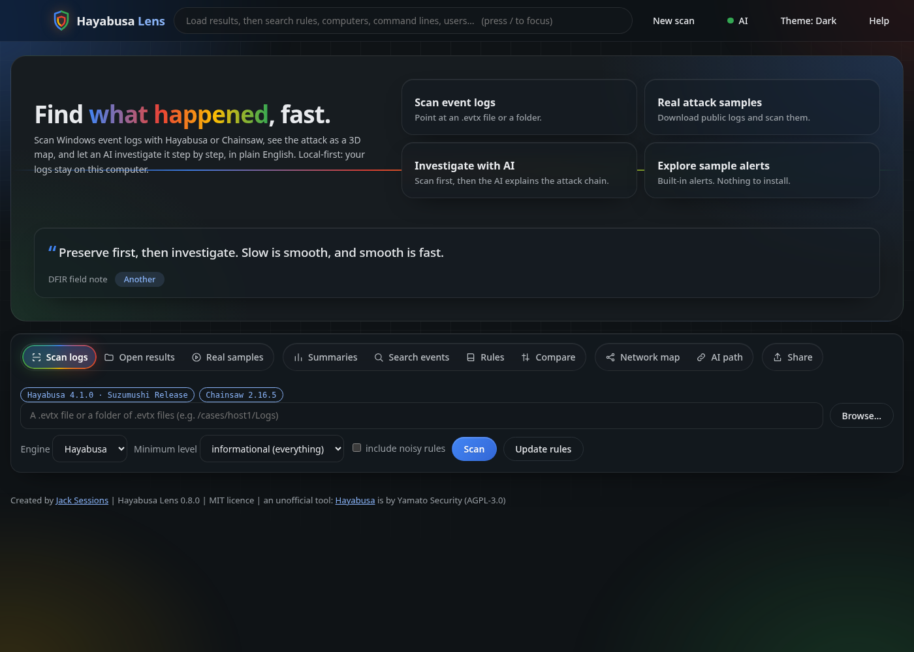
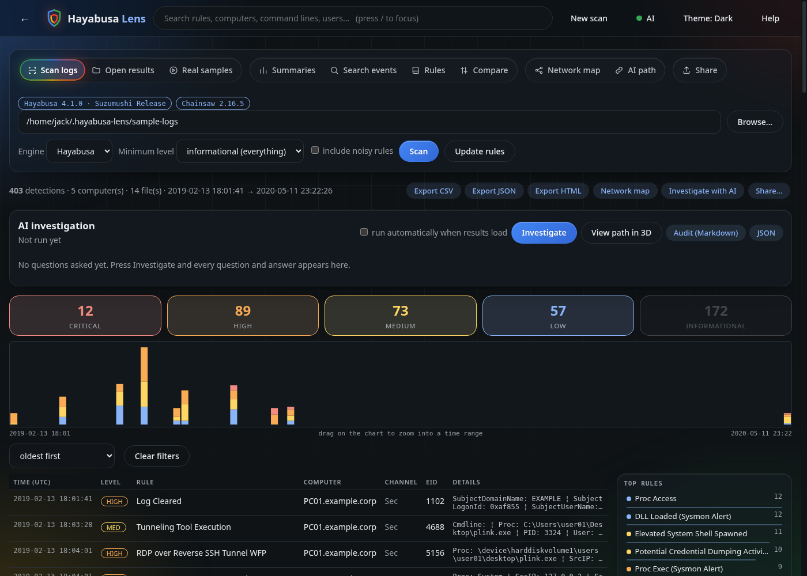
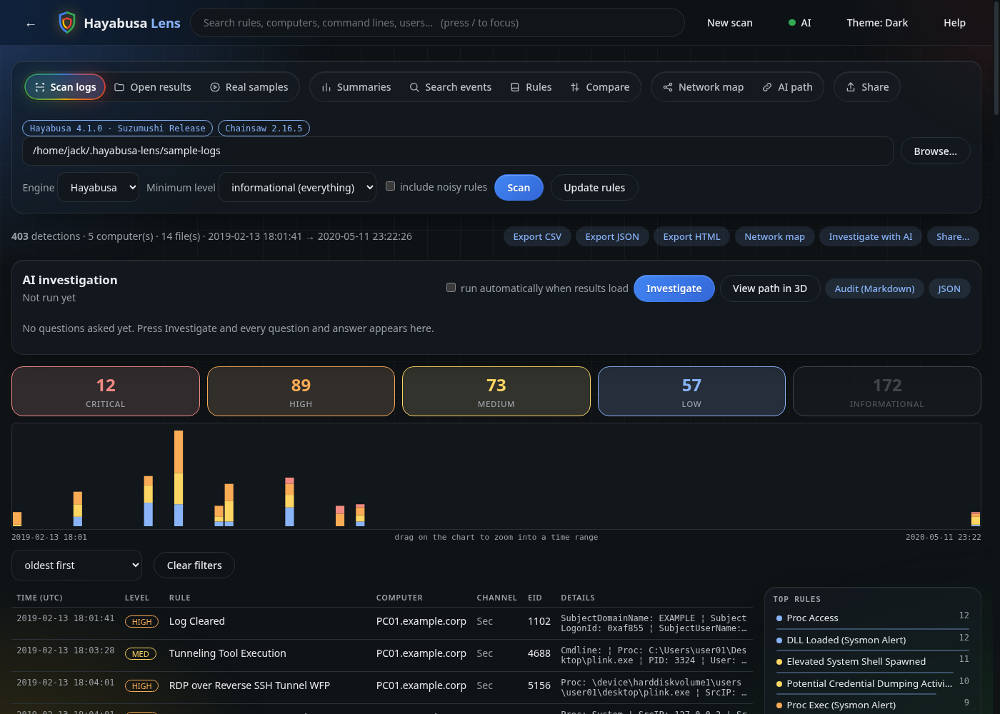
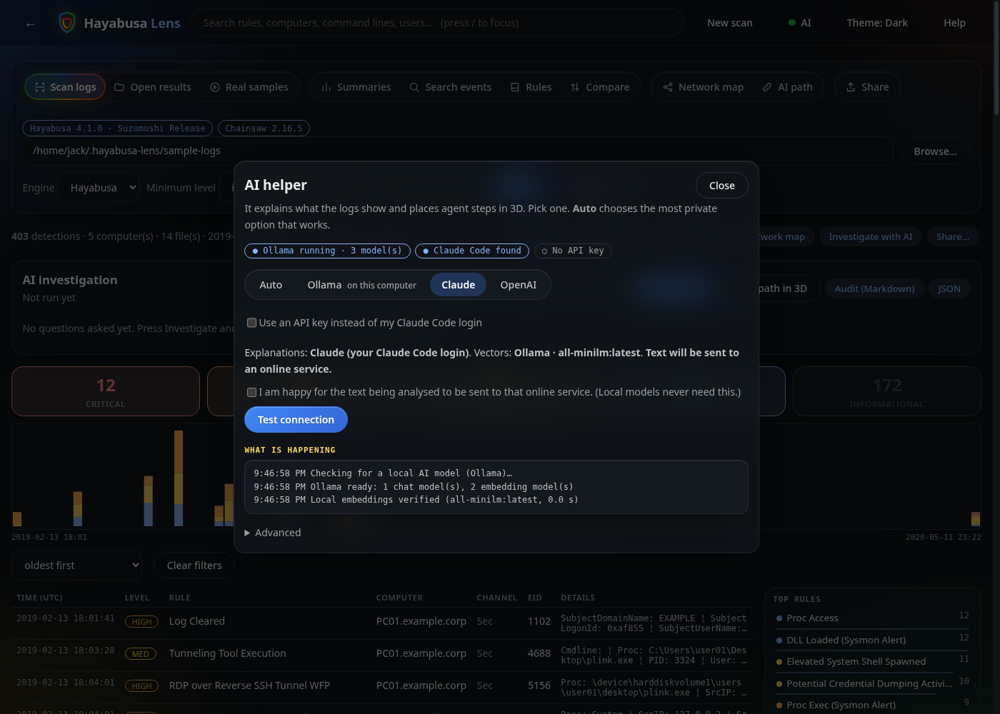
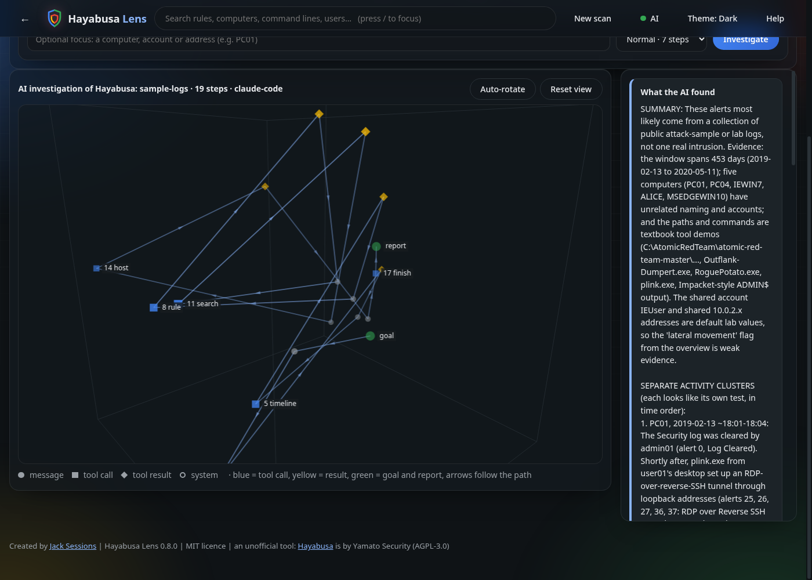
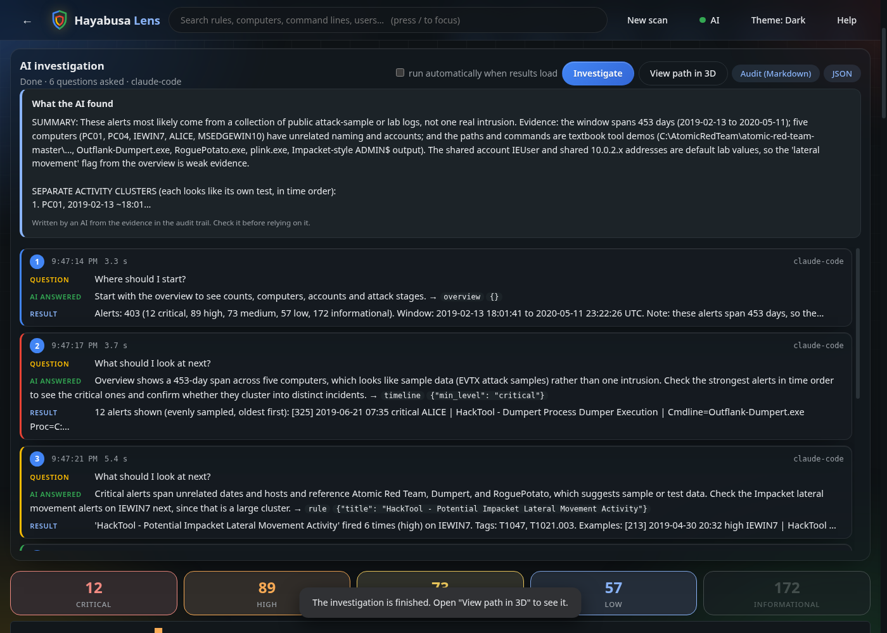
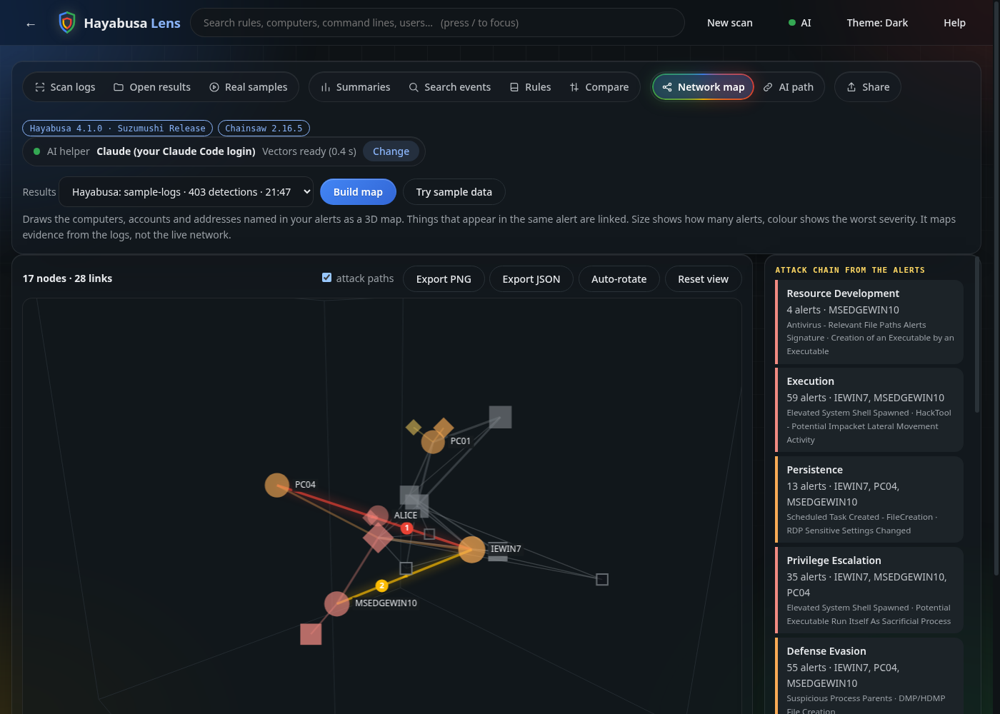
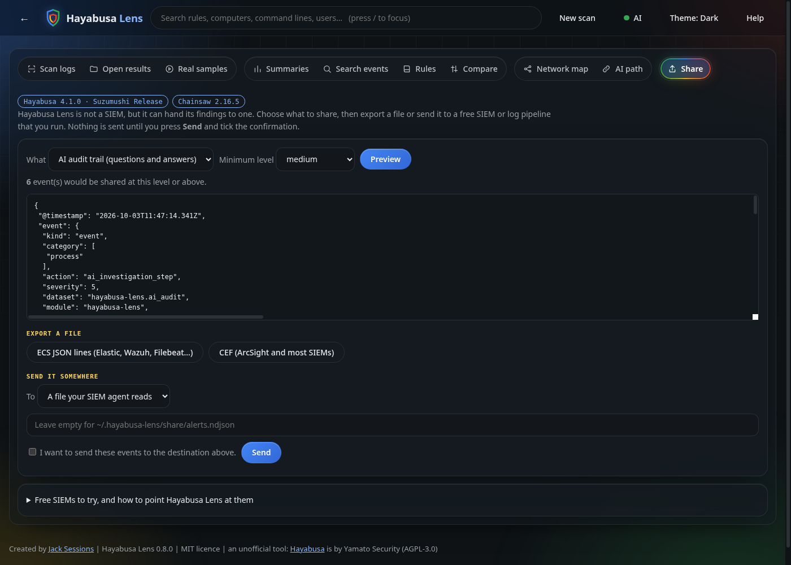
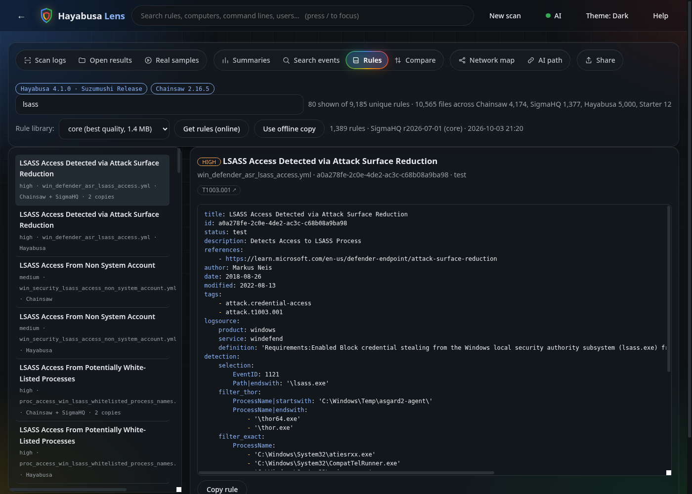
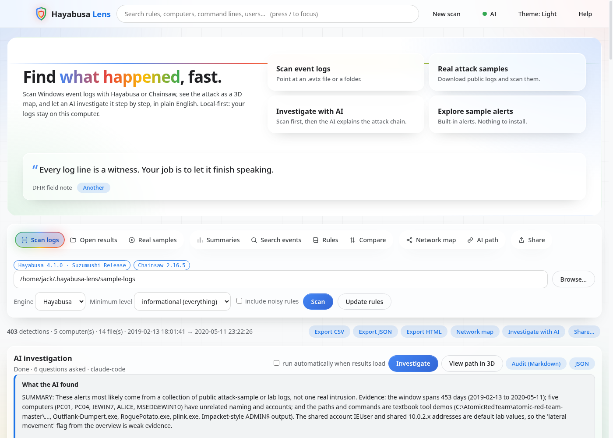

# Hayabusa Lens


**Find what happened in Windows event logs, fast.** An unofficial dashboard for [Hayabusa](https://github.com/Yamato-Security/hayabusa) and [Chainsaw](https://github.com/WithSecureOpenSource/chainsaw). Scan `.evtx` files, explore the alerts, see the attack as a 3D map, and let an **AI helper investigate it step by step** and explain the attack chain in plain English. Every question it asks and every answer it gets is kept in an **audit trail** on the dashboard. It can hand findings to a free SIEM, and runs in your browser, on your computer.



## What you get

- **Two engines, one dashboard.** Hayabusa or Chainsaw, each with a checksum-verified *Download it for me* button.
- **A clear dashboard.** Severity tiles, a zoomable timeline, click-to-filter rules, ATT&CK tactics, computers and event IDs, and the detection rule shown right in the event drawer.
- **Investigate with AI.** The AI explores your results with read-only tools (overview, host, rule, search, timeline, event), decides what to look at next, then writes the attack chain: what happened, where, roughly when, which alert shows it, what is solid and what is a guess. It can run automatically when results load (by default only when a local model is set up, so nothing leaves your computer).
- **AI audit trail.** Every question put to the AI, every answer, the tool it chose and what the tool returned, with times and durations, live on the dashboard. Click a step for the full question and raw answer. Export as Markdown or JSON, or send it to a SIEM.
- **AI path 3D.** The same investigation drawn as a path in 3D: tool calls, results, the goal and the report.
- **Network map 3D.** Computers, accounts and addresses from any `.evtx` scan, with an attack-chain panel (ATT&CK stages in order), numbered **attack paths** between computers, and *Explain* buttons.
- **AI helper, your way.** Auto, a local model with Ollama (started for you), Claude (your Claude Code login, no key needed, or an API key), or OpenAI.
- **Share.** Export ECS JSON lines or CEF, or send alerts to a file, syslog, Elasticsearch/OpenSearch, Splunk HEC or a webhook, only after a preview and an explicit confirmation.
- **Rule library.** A folder of SigmaHQ rules you can refresh online, or use offline. The Rules tab shows each rule once, with where it ships (Hayabusa, Chainsaw, SigmaHQ).
- **A night-security look in Google colours.** Frosted glass, a four-colour shield, glowing animated rings on buttons (reduced-motion friendly), dark, greyscale and light themes, a Back button, and a DFIR field note on the home screen.
- **More:** compare two scans, search every event, summaries, three themes, built-in help, CSV/JSON/HTML export.

| Dashboard (real public sample logs) | Detection rule in the drawer |
|---|---|
|  |  |

## Install and run (Windows, macOS, Linux)

You need **Python 3.9 or newer**. Hayabusa Lens has no other dependencies. The cleanest way to install it is **pipx**:

```
python3 -m pip install --user pipx      # Windows: py -m pip install --user pipx
python3 -m pipx ensurepath              # then open a new terminal
pipx install hayabusa-lens                                      # from PyPI
pipx install git+https://github.com/JackSessions/hayabusa-lens  # latest from GitHub
```

Update with `pipx upgrade hayabusa-lens`. Try without installing: `pipx run hayabusa-lens --demo`.

## Commands

```
hayabusa-lens                          open the app (Hayabusa is found automatically; Ollama is started if installed)
hayabusa-lens /cases/host1/Logs        scan a folder of .evtx files straight away
hayabusa-lens results.csv              open an existing Hayabusa/Chainsaw timeline
hayabusa-lens --samples                download 14 real attack-simulation logs (about 1 MB) and scan them
hayabusa-lens --install-hayabusa       download Hayabusa for this computer (checksum-verified)
hayabusa-lens --install-chainsaw       optional: Chainsaw with its Sigma rules
hayabusa-lens --get-rules [SET]        fill the rule library (core, core+, core++, all, emerging); add --offline for no internet
hayabusa-lens --no-ai-start            do not start Ollama automatically
hayabusa-lens --demo                   explore built-in sample alerts (no Hayabusa needed)
hayabusa-lens --hayabusa PATH          use a specific Hayabusa (also --chainsaw PATH)
hayabusa-lens --port N --no-browser    pick a port, print the address instead of opening a browser
hayabusa-lens --help                   every option, with examples
```

Hayabusa is looked for in `--hayabusa`, `$HAYABUSA_PATH`, your `PATH`, `~/.hayabusa-lens`, then common download folders.

## A one-minute tour

```
hayabusa-lens --samples
```

1. The real sample logs are downloaded and scanned. The dashboard opens.
2. With Ollama set up, the AI starts investigating on its own. Otherwise press **Investigate**. The audit trail fills in live.
3. Press **View path in 3D**, or **Network map** for the computers, accounts and numbered attack paths.
4. Press **←** to go back through your tabs, or the shield to return home.

## The AI helper

Press **AI** at the top of the app.



| Choice | What you need | Where text goes |
|---|---|---|
| **Auto** | Nothing. Picks the most private option that works. | Stays on your computer if Ollama is set up |
| **Ollama** | [Ollama](https://ollama.com/download) (free). Hayabusa Lens starts it, checks it works, and offers a small download for any missing model. | Stays on your computer |
| **Claude** | Claude Code logged in (no key), *or* a Claude API key | Sent to Anthropic. Needs the consent tick |
| **OpenAI** | An OpenAI API key | Sent to OpenAI. Needs the consent tick |

- **API keys.** Paste one and press *Use key*: it is kept in memory until you close Hayabusa Lens and is never written to disk. Or set `OPENAI_API_KEY` / `ANTHROPIC_API_KEY` first. A Claude.ai or ChatGPT *subscription* is not an API key.
- **Claude through Claude Code** runs `claude -p` with every tool switched off (`--tools ""`) and no saved session, so text in your logs can never make it run anything.
- **Test connection** makes a tiny real request. **What is happening** shows what the AI layer is doing (starting Ollama, asking a model, how long it took).
- **Honest expectations.** Small local models write shallower reports than Claude or GPT-class models. In testing on the public sample logs, Claude correctly noticed they look like a collection of attack simulations rather than one real intrusion, and a 3.8B local model did not. AI text is a lead, not proof: check it against the alerts.

## Investigate with AI and the audit trail



The AI gets a goal and read-only tools over the alerts already in memory: `overview`, `host`, `rule`, `search`, `timeline`, `event`, and `finish`. Each turn it replies with one JSON action; Hayabusa Lens runs it and gives back the result. Tools cannot run commands, read files or use the network, and tool output is passed back fenced as untrusted data.



The **audit trail** records, for every step: the question put to the AI, what it answered, the tool it chose, what that tool returned, the time and how long it took. Click a step for the full question and raw answer. Export it from the dashboard (`Audit (Markdown)`, `JSON`) or send it to a SIEM from the Share tab. The 3D path draws the same steps: blue squares are tool calls, yellow diamonds are results, green is the goal and the report.

## Network map and attack chain



Built from any scan, opened result or the sample alerts. Computers sit on a ring in the order they first raised an alert, with their accounts and addresses around them. Size is alert count, colour is worst severity, diamonds are accounts, squares are addresses (outlined means external). The panel on the right orders the ATT&CK stages seen, with no AI needed. **Attack paths** (numbered, glowing arrows) follow an account or address from the first computer it appeared on to the next, in time order. They are evidence from the logs, not proof of movement. *Explain the attack chain* turns it into a plain-English story; click a node to explain or investigate just that computer, account or address. It maps evidence in the logs, not the live network.

## Share with a SIEM (optional)



Hayabusa Lens is not a SIEM and keeps no database. The **Share** tab previews, then exports or sends:

| Destination | Notes |
|---|---|
| File (ECS JSON lines) | Point a Wazuh `<localfile>` (json), Elastic Agent, Filebeat or Vector at it |
| Syslog UDP/TCP | CEF or JSON; Graylog, Wazuh, Security Onion and most SIEMs |
| Elasticsearch / OpenSearch | `_bulk` with `Authorization: ApiKey …` or `Basic …` |
| Splunk HEC | `Authorization: Splunk <token>` |
| Webhook | Any URL, JSON array |

Events use ECS field names (`event.kind: alert`, `rule.*`, `host.name`, `source.ip`, `user.name`, `threat.*`). Nothing is sent until you preview, tick the confirmation and press Send. Plain `http://` is refused for public addresses and credentials are never saved. Tested against local listeners and fake servers, not every vendor, so start with a small minimum level.

## Rule library



The **Rules** tab de-duplicates: the same Sigma rule ships with Hayabusa, Chainsaw and the library, so it is listed once with its sources. *Update rules* now ends with a plain "Rules updated" message and the new count.

`~/.hayabusa-lens/rules` is always populated: `hayabusa-lens --get-rules` fetches the newest SigmaHQ release (checksum-verified), `--offline` uses the last download or 12 built-in starter rules. The Rules tab shows where they came from. Sigma rules belong to the [SigmaHQ](https://github.com/SigmaHQ/sigma) community (Detection Rule License 1.1).



## How it works and privacy

Hayabusa Lens runs `hayabusa dfir-timeline` (or the older `json-timeline` / `csv-timeline`) or `chainsaw hunt` as a separate process, reads the JSONL it writes, and deletes it. It does not copy or include any Hayabusa or Chainsaw code. A small web server listens on `127.0.0.1` only, with a random one-time token and a host-name check, and only reads files you point it at.

Your logs stay on your computer unless you choose an online AI service and tick the consent box, or press Send on the Share tab. Results are held in memory only.

## Sample logs

Sample logs are **not bundled**. When asked, they are downloaded from the public [hayabusa-sample-evtx](https://github.com/Yamato-Security/hayabusa-sample-evtx) collection (DeepBlueCLI, EVTX-ATTACK-SAMPLES, EVTX-to-MITRE-Attack, Yamato Security). Your antivirus may flag them because of attack keywords; they contain no executable code. Because they come from many unrelated machines, the "attack" in them is a mix of simulations, not one incident.

## Tested

`python -m unittest discover -s tests -v` runs 117 tests: loaders, filters, the server's security checks, exports, the Hayabusa and Chainsaw subprocess flows (with stand-in programs), the rule library and rule de-duplication, the investigator loop and audit trail (with a scripted model), attack paths, the AI layer (fake services, no network), and sharing (real local sockets and fake HTTP servers). In CI, a separate job runs the real Hayabusa on real sample logs. A manual click-through checklist, including Windows, is in [docs/TESTING.md](docs/TESTING.md). Windows and macOS are covered by unit tests only; most hands-on testing was on Linux.

## Known limitations

- Hayabusa's `pivot-keywords-list` and `extract-base64` are not in the interface yet.
- Logs must be Windows `.evtx` (or an existing timeline). Hayabusa's JSON-input mode produced no detections in testing, so it is not exposed.
- Results live in memory: comfortable for hundreds of thousands of detections, not tens of millions. Use a minimum level for huge scans.
- The investigator only sees the alerts the engine produced, not the raw logs, and a model can still be wrong.
- Summaries and Search events are Hayabusa-only.

## Credit and licence

Created and maintained by **Jack Sessions**. Parts of the code were written with AI assistance (Claude); the behaviour is covered by the tests above.

This is an **unofficial** tool and is not affiliated with Yamato Security or WithSecure. **Hayabusa** is by [Yamato Security](https://github.com/Yamato-Security) (AGPL-3.0). **Chainsaw** is by [WithSecure](https://github.com/WithSecureOpenSource/chainsaw) (GPL-3.0). Neither engine is bundled; please credit them and read their licences if you redistribute them. Hayabusa Lens is a separate program under the **MIT licence** (`LICENSE`). If you use it in a report, talk or course, please credit Jack Sessions and link https://github.com/JackSessions/hayabusa-lens (`CITATION.cff` has the details).
